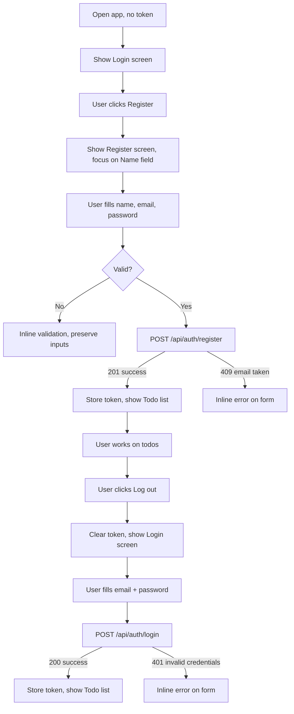
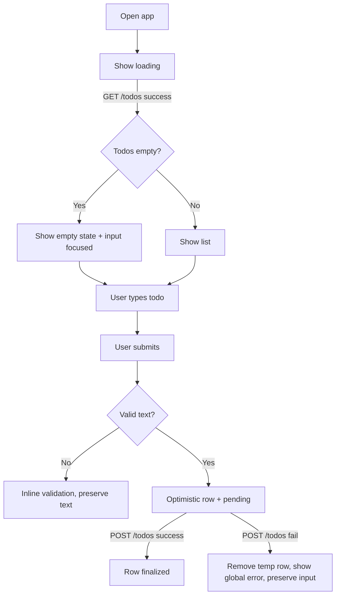
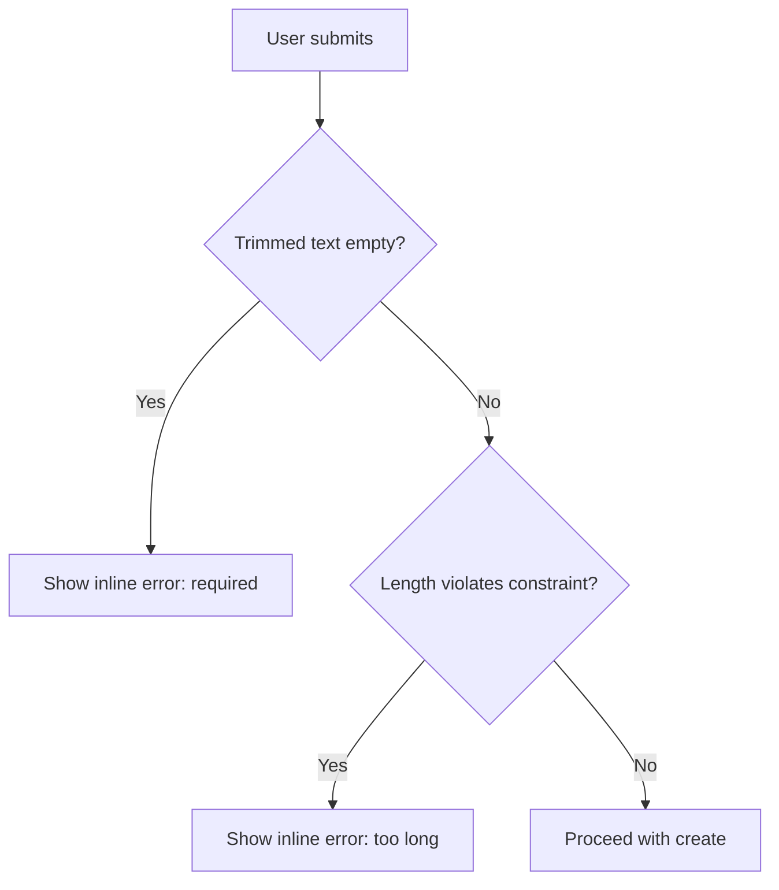
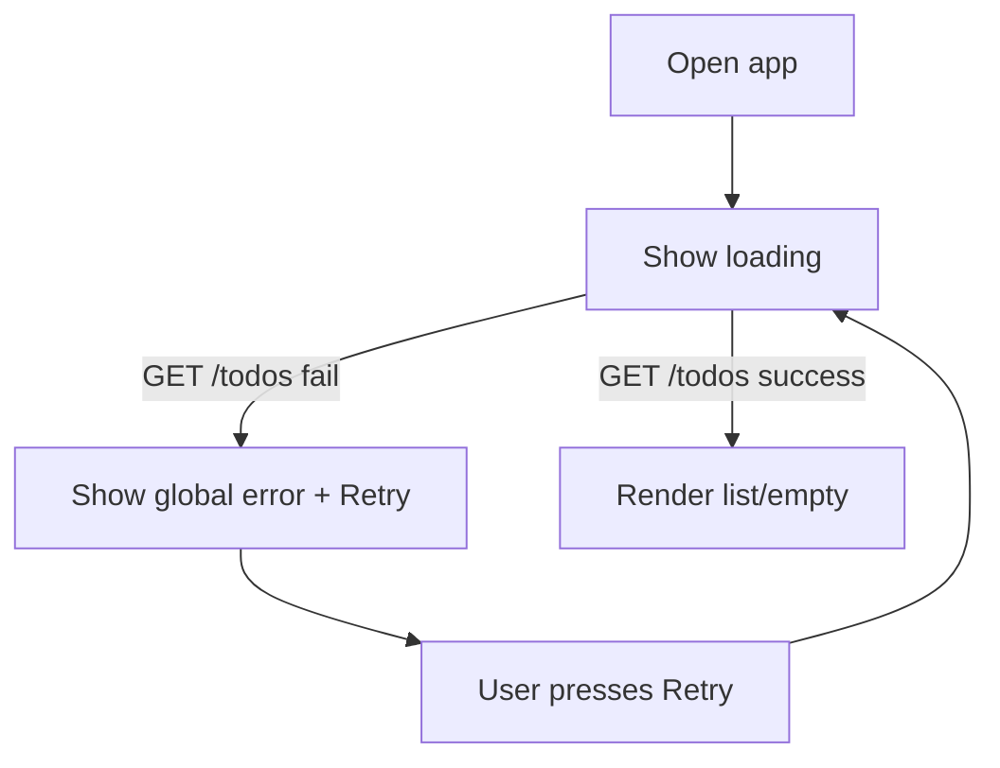
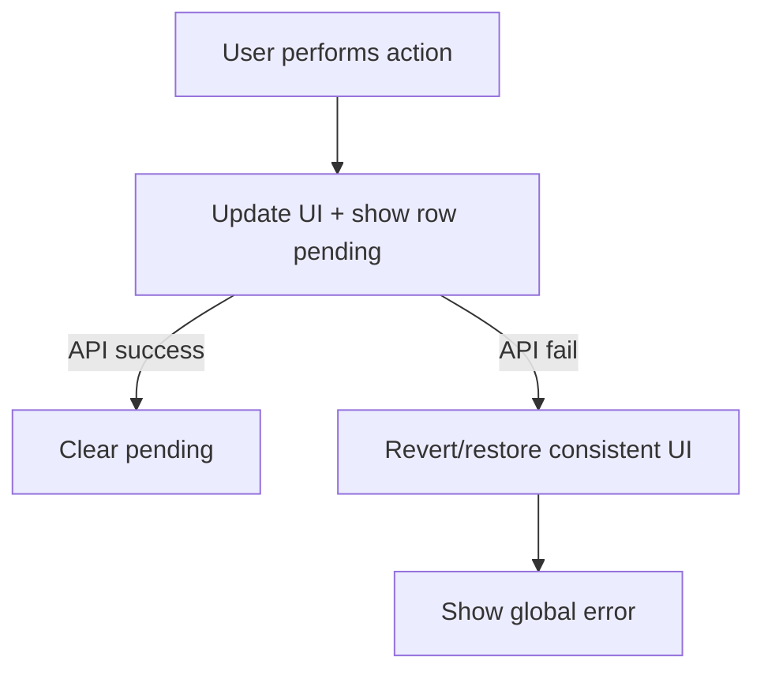

# UX Design Specification bmad-todo

**Author:** Andrea
**Date:** 2026-03-26

> **Rendered mockups:** [`docs/mockups/`](../../docs/mockups/) — self-contained HTML files using the real design tokens, with committed screenshots. Update mockups whenever a screen layout or design decision changes. See `project-context.md § UX Mockups` for the full workflow.

---

## Executive Summary

### Project Vision

A mobile-first, single-user todo web app that makes the “capture → adjust → complete → remove” loop feel effortless while staying predictable under failure. No onboarding. No “power user” complexity.

### Target Users

- **Primary:** A single casual user managing personal reminders day-to-day on a phone.
- **Secondary:** The maintainer (you) validating reliability, clarity, and testability.

### Key Design Challenges

- **Resilience-first UX without complexity:** Every failure must be visible, recoverable, and must not leave “ghost state.”
- **Fast time-to-first-value:** First todo created within ~30 seconds on first load.
- **Small-screen comfort:** One-thumb use; tap targets and text legibility at ~320px.
- **Inline edit without confusion:** Editing must be obvious, reversible, and not lose user input.

### Design Opportunities

- **Intentional minimalism:** One screen, one main action, zero distraction.
- **Predictable state model:** Consistent patterns for loading/empty/error/pending.
- **Quality cues:** Subtle “saving…” states and clear error recovery.

## Core User Experience

### Defining Experience

The app is a single surface: a list and an input. It should feel like writing something down, not managing a system.

The core loop is:

1. See your current list immediately
2. Add a todo
3. Adjust wording (edit)
4. Mark it done (toggle)
5. Remove it (soft delete)

### Platform Strategy

- **Platform:** Web SPA.
- **Primary interaction:** Touch-first (mobile), fully usable with mouse/keyboard.
- **Offline:** Not required. When offline or API down, the user should see a clear global error and be able to retry.

### Effortless Interactions

- **Capture:** Typing + submit is always visible and always works the same way.
- **Edit:** Tap the text to edit in place; Enter in title moves to description; Ctrl/Cmd+Enter in description saves; Escape cancels.
- **Complete:** One tap on checkbox toggles state; feedback is instant.
- **Delete:** One tap on delete affordance; confirmation is _not_ required in MVP (to keep flow fast), but failures must not remove items silently.

### Critical Success Moments

- **First load clarity:** The user understands what to do even when the list is empty.
- **First todo appears:** The user sees immediate feedback that the app “took it.”
- **Failure still feels controlled:** Errors are visible, consistent, and recoverable.

### Experience Principles

- **One screen, one job:** Managing personal todos.
- **Never lie with UI:** No silent failures; no “ghost” items.
- **Preserve user effort:** Never clear typed text on validation or network failure.
- **Mobile-first clarity:** Make the primary action obvious and reachable.

## Emotional Response

- **At open:** “Calm and ready.” (no clutter, no ambiguity)
- **After add:** “Relief.” (captured quickly)
- **During edit/toggle/delete:** “Confidence.” (clear feedback that it saved)
- **On failure:** “Still in control.” (clear message + safe retry)

## UX Patterns & Inspiration (Guidance)

- Pattern inspiration: minimal note-taking apps and lightweight task lists.
- Interaction inspiration: “inline edit” patterns used in simple list managers.
- Reliability inspiration: predictable banners for errors; explicit pending states.

## Information Architecture

### App Shell

All screens share a persistent `AppHeader` component (see [ADR: Auth UI Layout](../../docs/decisions/adr-auth-ui-layout.md)):

```
Unauthenticated:   [Todos]          [Log in]  [Register]
Authenticated:     [Todos]                      [Log out]
```

The header right-hand content adapts to auth state. Below the header, the active screen is rendered conditionally.

### Screens

- **Login Screen** — shown when no auth token is present (default unauthenticated landing)
  - Persistent `AppHeader` with `Log in` active
  - Email and password fields
  - "Don't have an account? Register" link (navigates to Register screen)

- **Register Screen** — reachable from the Login screen
  - Persistent `AppHeader` with `Register` active
  - Name, email, and password fields
  - "Already have an account? Log in" link (navigates to Login screen)

- **Todo List Screen** — shown when a valid auth token is present
  - Persistent `AppHeader` with `Log out` button
  - Global error region (persistent until dismissed or resolved)
  - Add todo form
  - List state region (loading | empty | list)

**Create/edit are contextual:** there is **no dedicated page** for creating or editing tasks. The user stays on the Todo List screen; creation happens in the Add form and editing happens in-context.

### Horizontal Alignment System

All page-level content aligns to a single horizontal edge: `var(--s-space-4)` (16px) margin from each side of the `#root` container. This applies to:

- Header elements (`margin: 0 var(--s-space-4)`)
- Auth form fields (form uses the same margin)
- Todo list and add form (existing convention)
- Error banners (full-width background, inner content respects the margin)

Do not use padding on the `main` element for horizontal alignment — it prevents full-width background fills from reaching the container edges.

## Core Screens (Wireframe-Level)

### Screen: Login (Default unauthenticated)

**Header area**

- `AppHeader`: "Todos" title left, "Log in" (active/bold) + "Register" links right

**Form area**

- Email field (type="email", required)
- Password field (type="password", required)
- Submit button "Log in" (disabled + "Logging in…" during request)
- Inline error region (role="alert") — displays 401 errors from the server; not the GlobalErrorBanner

**Footer link**

- "Don't have an account? Register" — switches to Register screen

### Screen: Register

**Header area**

- `AppHeader`: "Todos" title left, "Log in" + "Register" (active/bold) links right

**Form area**

- Name field (type="text", required)
- Email field (type="email", required)
- Password field (type="password", required, min 8 chars)
- Submit button "Create account" (disabled + "Creating account…" during request)
- Inline error region (role="alert") — displays 409 errors from the server

**Footer link**

- "Already have an account? Log in" — switches to Login screen

### Screen: Todo List (Default)

**Top area**

- Title: “Todos”
- Global error banner region (only visible when error active)

**Add form**

- Single-line input (or textarea that behaves like single-line on Enter)
- Primary action: “Add”
- Inline validation message under input (only shown when invalid)

**No create page**

- Creating a todo never navigates away from this screen.

**List area**

- Loading state OR Empty state OR List

**Ordering & visibility rules**

- Todos are shown **newest created first**.
- Soft-deleted todos are **not shown** in the default list.

**Todo item row (repeated)**

- Completion toggle (checkbox)
- Todo text (read-only label OR inline edit input)
- Delete button
- Optional per-row “saving…” indicator (text or spinner) during pending mutations

## States & Behaviors

### Loading State (initial load)

- Show a loading indicator in the list region.
- Do not show empty state while loading (avoid confusion).

### Empty State

- Friendly copy: “No todos yet.”
- Prompt: “Add your first one above.”
- Keep the input focused/ready.

### Global Error Element

A consistent global error surface used for:

- Initial list load failure
- Network/server failures during create/edit/toggle/delete

**Behavior**

- Error banner includes:
  - Short message suitable for end users
  - Optional “Retry” when the last action is retryable without additional user context (e.g., failed `GET /todos`)
  - Dismiss action (optional; if dismissed, error remains in internal state for debugging but is not shown)
- For mutation errors, the banner should explain what didn’t save and that the user can retry by repeating the action.

**Copy guidance (examples)**

- Load failure: “Couldn’t load todos. Check your connection and try again.” + `Retry`
- Mutation failure: “Couldn’t save changes. Please try again.”

### Create Todo

**Happy path**

- User types text and submits.
- UI responds immediately:
  - Option A (recommended): Optimistically add a temporary row with a pending indicator.
  - On success: pending clears and item is finalized.
  - On failure: temporary row is removed, input value is restored (or never cleared), global error shown.

**Validation**

- Reject empty/whitespace-only.
- Reject too-long input based on configured constraint.
- Preserve typed text on validation failure.

**Length constraint handling (architecture-aligned)**

- Use the shared product constant `MAX_TODO_TEXT_LENGTH = 200` (single source of truth in `src/shared`).
- Optionally also derive `{max}` from API validation error details to avoid drift.
- Inline message template: “Todo text must be between 1 and {max} characters.”

### Edit Todo (Inline)

**Entry**

- Tap/click todo text to enter edit mode.

**No edit page**

- Editing a todo never navigates to a separate route/screen.
- Default interaction is inline edit.
- If inline edit is not workable for a given layout, use a lightweight modal/bottom-sheet editor that opens from the row and closes back to the same list context.

**Edit mode UI**

- Replace label with title input and description textarea, prefilled with current values.
- Controls:
  - Enter in title input moves focus to description textarea
  - Ctrl/Cmd+Enter in description textarea saves
  - Enter in description textarea inserts a newline
  - Escape in either field cancels edit and restores original values
  - Blur (focus leaving the edit area) auto-saves if no validation error

**Pending + failure**

- On save, show per-row pending.
- If save fails:
  - Revert to last known saved text (or keep editing open with unsaved value clearly indicated).
  - Global error is shown.
  - Never silently discard typed text: if reverting, keep the unsaved text in the edit field when possible.

### Toggle Complete

**Happy path**

- Toggle updates immediately (optimistic) and shows pending.
- Completed todos are visually distinguishable (e.g., reduced emphasis, strikethrough, or muted style).

**Failure**

- Revert checkbox to previous state.
- Show global error.

### Delete Todo (Soft Delete)

**Happy path**

- On delete press, show per-row pending.
- Remove row only when API confirms delete.

**Failure**

- Keep row visible (not removed).
- Show global error.

## Interaction Details (Micro-spec)

### Keyboard Support

- `Tab` navigates: Global error actions → Add input → Add button → list items (toggle, edit, delete).
- In add form:
  - `Enter` in title input submits the form (HTML default)
  - `Ctrl/Cmd+Enter` in description textarea submits the form
  - `Enter` in description textarea inserts a newline
  - `Tab` from description reaches the Add button
- In inline edit mode:
  - `Enter` in title input moves focus to description textarea
  - `Ctrl/Cmd+Enter` in description textarea saves
  - `Enter` in description textarea inserts a newline
  - `Escape` in either field cancels edit

### Focus Management

- After successful add: return focus to the add input.
- After delete:
  - Move focus to the next logical control (next item’s toggle) or back to add input if list becomes empty.
- After global error appears: do not steal focus; announce via aria-live.
- After auth screen switch (login ↔ register): move focus to the first field of the new form.

### Ordering Feedback

- After successful create, the new todo appears at the **top** of the list.

## User Journey Flows

### Journey 0 — Register and log in for the first time



### Journey 1 — Capture a task immediately (Happy path)



### Journey 2 — Validation edge case (empty/too long)



### Journey 3 — API down (initial load failure + retry)



### Journey 4 — Mutation failure (edit/toggle/delete)



### Journey Patterns

- **One global error surface** for all server/network failures.
- **Inline validation** only for user input problems.
- **Row pending** indicator for all mutations.

### Flow Optimization Principles

- Keep the add input always visible.
- Avoid multi-step operations.
- Make failures explicit, consistent, and recoverable.

## Component Strategy (Implementation-facing)

### Core UI Components (MVP + Auth — Story 6.4)

- **AppHeader** — persistent adaptive header (see [ADR: Auth UI Layout](../../docs/decisions/adr-auth-ui-layout.md))
  - Title ("Todos") — always present
  - Right slot: `Log in` + `Register` nav links (unauthenticated) or `Log out` button (authenticated)
  - Active nav link is visually distinguished (bold or accent underline)
- **LoginForm** — email + password fields, submit, inline server error
- **RegisterForm** — name + email + password fields, submit, inline server error
- App shell (single page)
- Global error banner
- AddTodoForm
  - text input
  - submit button
  - inline validation text
- TodoList
  - Loading state
  - Empty state
  - Items
- TodoItem
  - ToggleComplete control
  - InlineEditText
  - Delete button
  - Pending indicator

## Open Questions (PRD Clarifications)

- **Todo text max length:** Resolved by architecture — `MAX_TODO_TEXT_LENGTH = 200` shared by web and API.

### Reusable Interaction Helpers

- “Pending mutation” styling utility
- Error message mapping utility (API error → UI copy)

## UX Consistency Rules (Non-negotiables)

- **Never clear typed text on failure** (validation or network).
- **Never show empty state while loading.**
- **Never remove an item from the list until delete succeeds.**
- **If optimistic updates are used, always revert on failure** and clearly message the error.
- **All controls have accessible names** and are keyboard operable.

## Responsive Design & Accessibility

### Responsive Strategy

- Mobile-first single column layout.
- On larger screens: increase max width and spacing; do not introduce side panels or multi-column IA in MVP.

### Breakpoint Strategy

- **Mobile:** 320px+
- **Tablet:** 768px+
- **Desktop:** 1024px+

(Behavior stays the same; only spacing/typography scale.)

### Accessibility Strategy (Best-effort MVP)

- Semantic controls (`button`, `input`, `label`).
- Visible focus ring.
- Touch targets ≈ 44×44px where possible.
- Global error uses `role="alert"` or `aria-live="polite"` depending on implementation.

### Testing Strategy (UX acceptance)

- Keyboard-only pass for: add, edit, toggle, delete.
- Screen reader smoke test for: error banner announcements and control names.
- Responsive spot-check at 320px width.

### Implementation Guidelines

- Render todo text as plain text (no HTML injection).
- Keep error copy short and consistent.
- Ensure pending states are visible but not disruptive.
