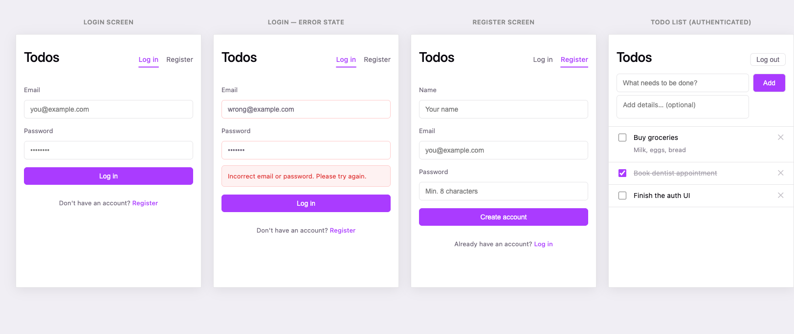
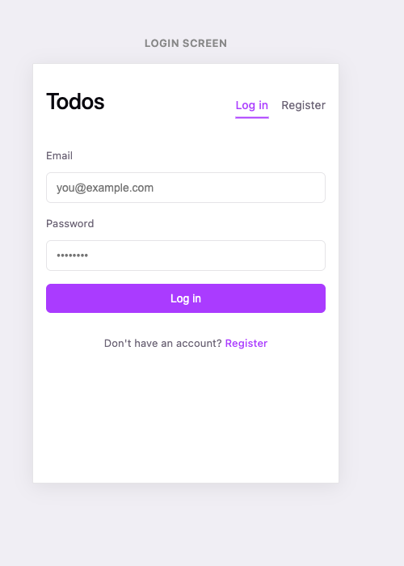
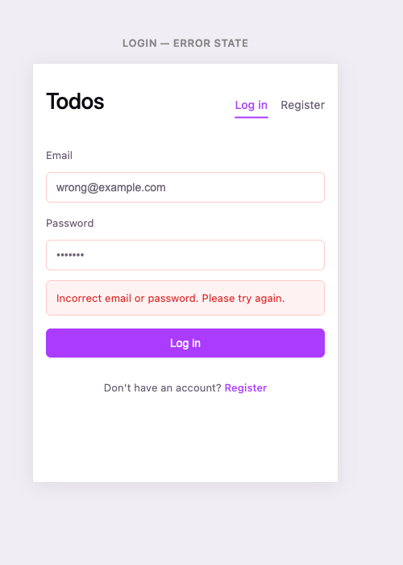
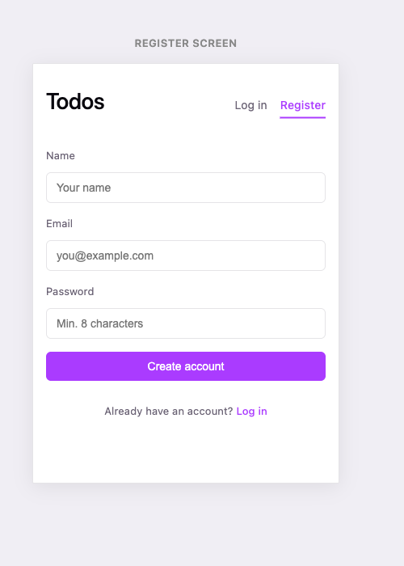
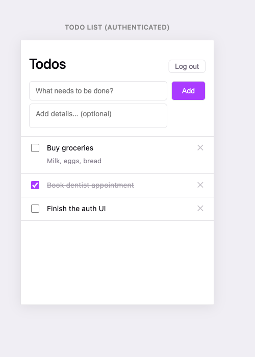

# ADR: Auth UI Layout and Navigation for Story 6.4

**Date:** 2026-04-11
**Status:** Accepted

## Problem

Story 6.4 introduces real login and register forms to replace the temporary `AuthGate` ("Create user & start" button) from Story 6.3. Three decisions must be made together:

1. **Navigation pattern** — how users move between the login and register screens
2. **Header treatment** — whether the app title and auth actions share a persistent structural element across all screens
3. **Alignment system** — how form fields, header content, and page-level elements align consistently at production quality

The existing `TodoApp` already has a header div (`display: flex; justify-content: space-between`) with the app title on the left and the logout button on the right. The `AuthGate` has no header — just a bare `h1` above the button. This inconsistency must be resolved.

## Context

**Current layout (post Story 6.3):**

- `#root`: 640px centered column, `border-inline`, `min-height: 100svh`
- `main.app`: flex column, gap via `--s-space-4`, top padding via `--s-space-8`
- `header` (TodoApp only): `flex; justify-content: space-between; margin: 0 var(--s-space-4)`
- Auth screen: bare `h1` + unstyled `<button>` — no structural header

**Deviations from the auth strategy ADR (adr-auth-strategy.md):**

The auth strategy ADR specified httpOnly cookie transport. As of Story 6.1/6.3, the implementation uses `localStorage` + `Authorization: Bearer <token>` instead. The UI layout decision is transport-agnostic — it applies regardless of how the token is stored.

**Design language constraints:**

- No UI library — CSS Modules only
- No routing library — state-based conditional rendering
- Flat design (no cards, no modals for auth)
- Design tokens defined in `tokens/semantic.css` and `tokens/primitives.css`
- Mobile-first; 320px minimum; one-column layout throughout

## Options Considered

### Option A — Header Nav (persistent adaptive header)

The existing `TodoApp` header pattern (`space-between` flex row) is promoted to a **global layout element** used on all screens. Its right-hand content adapts to auth state:

```
Unauthenticated:   [Todos]          [Log in]  [Register]
Authenticated:     [Todos]                      [Log out]
```

- `Log in` / `Register` are nav links; the active one is visually distinguished (bold or accent underline)
- The same `header` div and CSS class apply everywhere — no screen-specific header variants
- Forms (login, register, todo form) appear below the header, full-width

### Option B — Tab Row

A dedicated two-tab strip sits beneath the `Todos` title on auth screens only. Active tab uses `--s-accent` underline. TodoApp header is unchanged.

### Option C — Bottom Link

No navigation chrome on auth screens. Each form has a contextual `"Don't have an account? Register →"` link beneath the submit button. Nav is purely in-form.

## Decision

**Option A — Header Nav (persistent adaptive header)**

### Rationale

1. **Zero new patterns.** The `header` div with `justify-content: space-between` already exists in `TodoApp`. Promoting it to a shared layout element is the minimum possible change — no new component types, no new layout rules.

2. **Structural consistency across all screens.** The `Todos` title and the auth action buttons occupy the same visual position regardless of auth state. This matches the mental model of a persistent app shell rather than two disconnected screens.

3. **Cleanest code path.** The `App` component can render a single `<AppHeader>` at the top and conditionally render the content below — auth form or todo list — in the same `<main>` element. No duplicated header markup across screen components.

4. **Mobile-appropriate.** Right-aligned text links in a flex header are a well-understood mobile pattern (they resolve to a single row at 320px with appropriate font sizes). No new affordances that require extra explanation.

5. **Logout button already belongs here.** The existing logout button is in the header — Option A formalises this intent rather than treating the header as a one-off implementation detail.

### Why not the others?

- **Option B (Tab Row):** Introduces a new interactive component (tabs) not used elsewhere. It would also be auth-screen-only, creating a header inconsistency between auth and todo screens.
- **Option C (Bottom Link):** Lower discoverability — a new user landing on the login form must scroll past the form to find the register link. On mobile, the link may be below the fold.

## Implementation Requirements

### 1. Shared `AppHeader` component

Extract a standalone `AppHeader` component from `TodoApp`. It receives the current auth view state and renders the appropriate right-hand content:

- No token: renders `Log in` and `Register` links, with the active view visually distinguished
- Token present: renders a styled `Log out` button

The `AppHeader` component must be self-contained — it takes only the props it needs to render correctly, with no knowledge of todo state.

### 2. Alignment system

Auth forms (login, register) and todo content must share a consistent horizontal alignment system. Without explicit alignment rules, padding and margin decisions made independently in each component create misaligned edges.

**Rule:** All page-level content — header elements, form fields, todo items, error banners — must align to a single horizontal edge defined by `--s-space-4` (16px) margin from each side of the container.

This means:
- The header uses `margin: 0 var(--s-space-4)` (already in place)
- Auth form fields are `width: 100%` within a form element that also uses `margin: 0 var(--s-space-4)` (matching the header)
- The todo list and add form already follow this rule via existing margin conventions

No new spacing tokens are introduced. The alignment system is a constraint on how existing tokens are applied, not an addition to the token vocabulary.

**Do not** use padding on the `main.app` element to achieve horizontal alignment — it would prevent full-width elements (e.g., error banners with background fills) from reaching the container edges.

### 3. Production quality checklist for auth UI

- **Focus management:** On screen switch (login ↔ register), focus moves to the first field of the new form
- **Accessible names:** All form controls have associated `<label>` elements (not `aria-label` shortcuts)
- **Error regions:** Inline auth errors use `role="alert"` so screen readers announce them on insertion
- **Button states:** The submit button is `disabled` during the pending request and shows loading copy ("Logging in…" / "Creating account…")
- **Password field:** Uses `type="password"` — never `type="text"`, even during error display
- **Keyboard nav:** `Tab` order follows visual order: first field → second field → (third field for register) → submit button → nav link
- **Touch targets:** All interactive elements ≥ 44×44px effective tap area
- **Validation timing:** Client-side validation triggers only on submit attempt; field-level re-validation clears on subsequent input (not on every keystroke)

## Visual Reference

All mockups use the real design tokens (`tokens/semantic.css`, `tokens/primitives.css`) — what you see below is the intended production appearance. Source: [`docs/mockups/auth-ui.html`](../mockups/auth-ui.html) — edit that file and re-screenshot when the design changes.

### All screens at a glance



### Login screen (default unauthenticated state)

- "Log in" nav link is active (accent colour + underline)
- "Register" nav link is muted/secondary
- Footer link: "Don't have an account? Register"



### Login screen — error state (wrong credentials)

- Both fields get the error border colour (`--s-border-error`)
- Inline error banner renders below the fields, above the submit button
- Uses `role="alert"` — not `GlobalErrorBanner`



### Register screen

- "Register" nav link is active; "Log in" is secondary
- Three fields: Name, Email, Password (min 8 chars placeholder)
- CTA: "Create account" (distinct from "Log in" to signal intent)
- Footer link: "Already have an account? Log in"



### Todo list (authenticated)

- Nav links replaced by a bordered "Log out" ghost button
- Header alignment, spacing, and font size are identical to auth screens
- Horizontal 16px edge alignment is consistent with form fields above



## Consequences

### Positive

- Structural consistency: every screen shares the same header anatomy
- Single source of truth for header layout — one component, one CSS module
- The 16px horizontal alignment rule is explicit and enforceable — any future component knows exactly where its edges should land
- Auth errors are isolated to their forms; the `GlobalErrorBanner` remains reserved for todo API failures only

### Negative / Trade-offs

- The `App` component becomes the orchestrator for more state (current auth view: `'login' | 'register'`) — it previously only tracked token presence
- `AppHeader` must be tested in both auth and authenticated states, slightly increasing test surface
- The right-aligned nav links on very narrow screens (< 360px) require attention — a wrapping or font-size breakpoint may be needed if the title and two links collide
